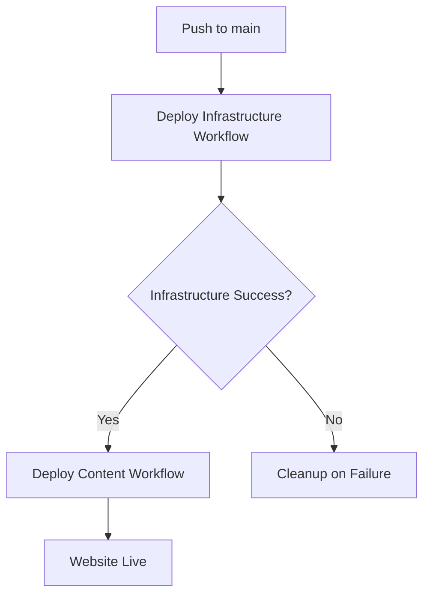

# Workflow Improvements Summary

## Problem Solved
Fixed the workflow dependency issue where content deployment could run before infrastructure was ready, causing failures for new deployments.

## Changes Made

### 1. Infrastructure Workflow (`deploy-infrastructure.yml`)
- **Removed pull_request triggers** to prevent conflicts with content deployment
- **Updated deployment summary** to reflect that content deployment will start automatically
- **Enhanced status messages** to guide users through the deployment process
- **Fixed YAML formatting** issues that were causing syntax errors

### 2. Content Deployment Workflow (`deploy-content.yml`)
- **Added workflow_run dependency** on infrastructure deployment completion
- **Configured proper triggering** only when infrastructure workflow succeeds
- **Enhanced job conditions** to handle both push and workflow_run events correctly

## Deployment Flow

## Key Benefits

1. **Prevents Race Conditions**: Content deployment can't start before infrastructure is ready
2. **Automatic Sequencing**: Content deployment starts automatically after infrastructure completes
3. **Better Error Handling**: Clear failure modes and cleanup procedures
4. **Enhanced Reporting**: Improved status summaries and next steps guidance

## Testing the Changes

To test these improvements:

1. Make a change to `website/index.html`
2. Push to the `main` branch
3. Observe the workflow sequence:
   - Infrastructure deployment starts first
   - Content deployment waits for infrastructure to complete
   - Content deployment runs automatically upon infrastructure success

## Notes

- The infrastructure workflow now only triggers on pushes to main and manual dispatch
- Content deployment can still be triggered manually if needed
- All existing functionality is preserved while adding proper sequencing